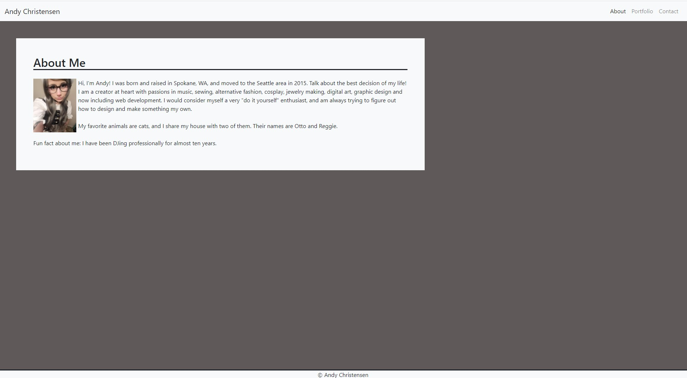
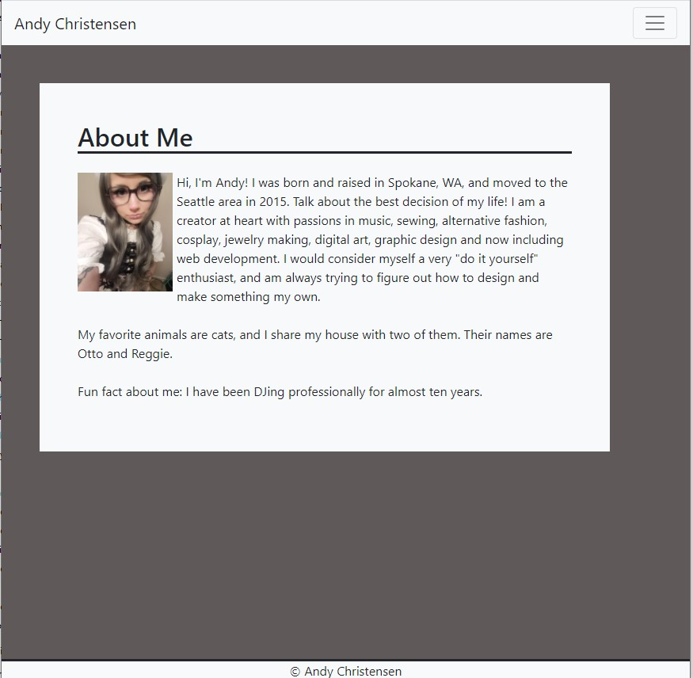
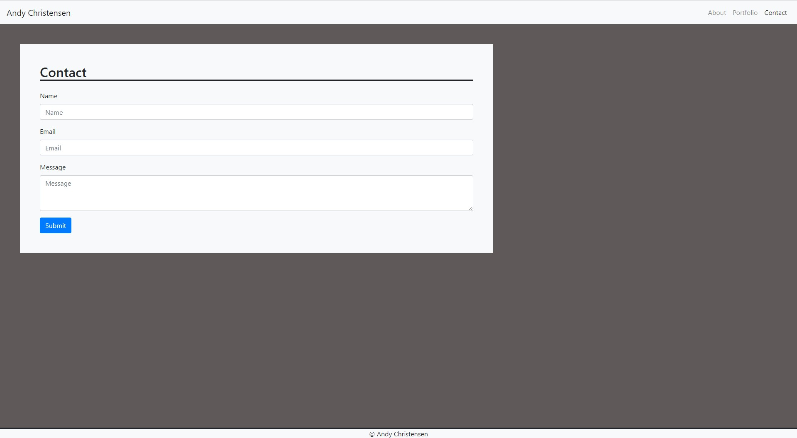
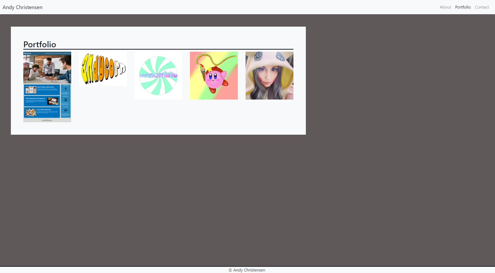

# ResponsivePortfolio

This project is an ongoing portfolio webpage that displays my works, bio as well as contact page with input text fields. It contains minimalistic stylings for an easy-to-read format in solid colors, putting emphasis on the content included. There are three pages; an about me page with a basic self bio that will be expanded as I grow my skillset, a contact page that will be updated with Javascript functionalAddity and a portfolio page showcasing examples of my work.

Each page features a collapsing navigation bar that will change appearance depending on the screen size (full navigation bar collapsing to hamburger menu), full Bootstrap responsiveness for multiple screen and device sizes, responsive content and a static footer that remains the same across all pages. This is achieved using Bootstrap 4.5.

The frameworks used:
HTML
Bootstrap 4.5 

Live Link: https://andychristensen90.github.io/ResponsivePortfolio/

